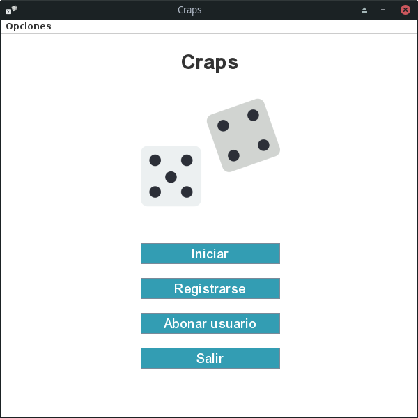
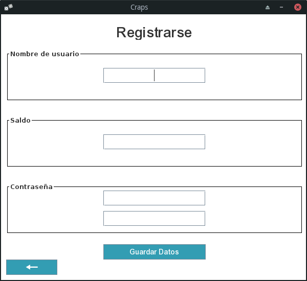
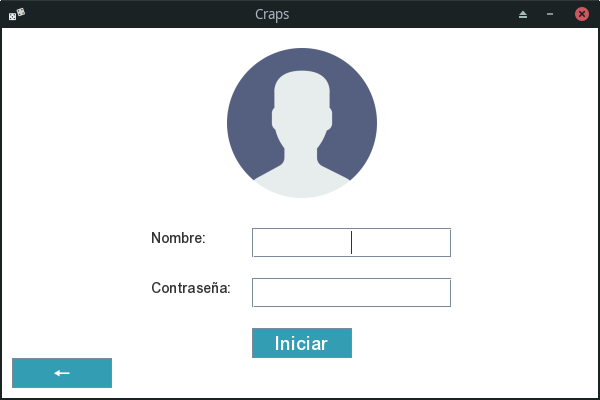
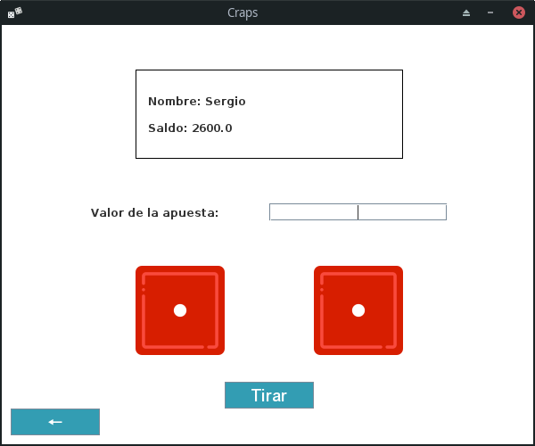
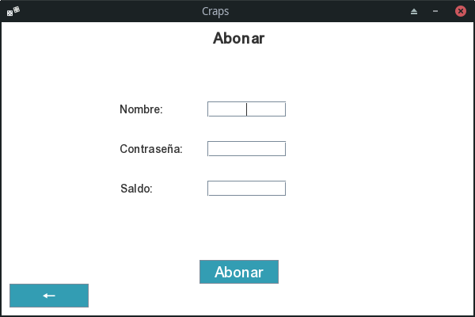

# Craps Game

Juego de craps implementado en java (Versión simplificada).

## Autor

- Sergio David Paez Suarez - spaezsuarez@gmail.com

## Reglas del juego (al menos para esta implementación)

Inicialmente se realizara el lanzamiento de dos dados,cuando esto ocurra se tomaran ciertas reglas dependiendo del valor obtenido.
 
- Si en el lanzamiento inicial el valor es 7 u 11 el jugado gana.
- Si el valor es distinto, el jugador seguira lanzando hasta obtener el mismo número.
- Si al lanzar por segunda vez obtiene el valor de 7 el jugador pierde.
- Si al lanzar por primera vez obtiene el valor de 2,3 o 12 el jugador pierde.

## Restricciones de la aplicación

- Si el jugador no tiene sufucuente saldo, no podra jugar y debera recargarlo.

## Vistas del programa

- Menu Principal

    

- Menu de registro

    

- Menu de inicio de sesion

    

- Menu de juego

    

- Menu para abonar

    

